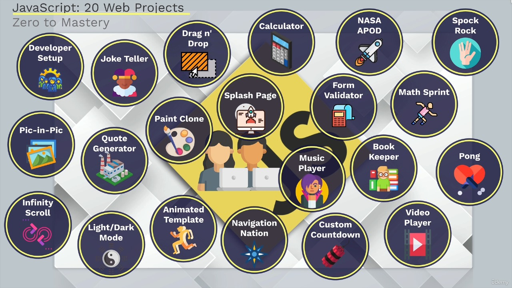
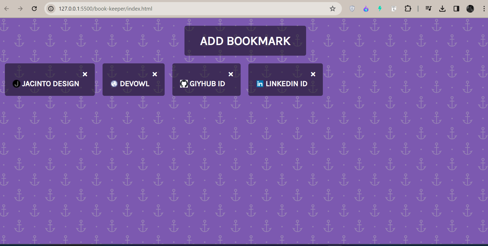
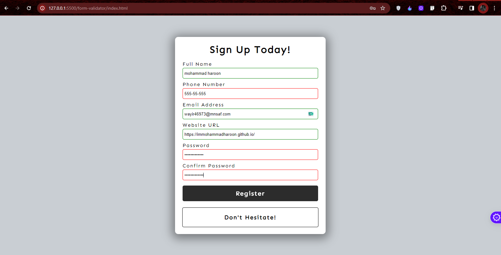
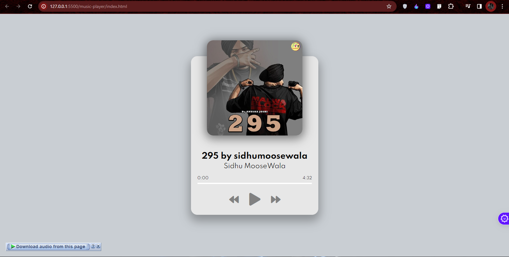

<h1 align="center">All Projects</h1>

Some projects to become expert in Java Script.

<h1 align="center">Book Keeper</h1>4

A simple bookkeeping application.

---

<h1 align="center">Navigated Navigation</h1>

A navigation system with advanced features for smooth browsing.

---

<h1 align="center">Custom Countdown</h1>

Create custom countdown timers for events and occasions.

---
<h1 align="center">Calculator</h1>

A calculator to solve your some problems.

---

<h1 align="center">Drag and Drop</h1>

Implement drag-and-drop functionality for elements on a web page.

---

<h1 align="center">Form Validator</h1>

Validate user input in forms using JavaScript.

---

<h1 align="center">Infinity Scroll</h1>

Implement infinite scrolling for dynamic content loading.

---

<h1 align="center">Joke Teller API</h1>

Fetch jokes from an API and display them to users.

---

<h1 align="center">Light and Dark Mode</h1>

Implement light and dark mode themes for your web application.

---

<h1 align="center">Math Sprint Game</h1>

A fast-paced math game to test your arithmetic skills.

---

<h1 align="center">Music Player</h1>

Create a web-based music player for playing audio files.

---

<h1 align="center">Paint Clone</h1>

A web-based application that mimics a basic paint program.

---

<h1 align="center">Picture in Picture</h1>

Implement a picture-in-picture mode for video playback.

---

<h1 align="center">Pong Game</h1>

A classic Pong game implemented in JavaScript.

---

<h1 align="center">Quote Generator</h1>

Generate random quotes and display them on the web page.

---

<h1 align="center">Splash Page</h1>

Create an attractive splash page for your website.

---

<h1 align="center">Video Player</h1>

Implement a customizable video player for playing video files.

